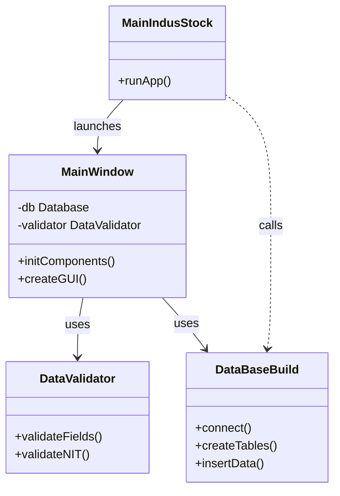

# $MA^3$ IndusStock

***"An undertaking of both obstacles and achievements, bringing forth essential lessons"***

# Planning
### 1. How was the problem addressed?

      # Escribir aqui como se abordo el problema

### 2. Diagrams

   a. Class diagrams

```mermaid

```
      # Diagrama de las clases codigo

   b. Database diagram

```mermaid
classDiagram
    class Proveedores {
        +IdNit: TEXT
        +Nombre: TEXT
        +FechaCompra: TEXT
        +FechaRegistro: TEXT
    }

    class Productos {
        +IdNit: TEXT
        +Proveedor: TEXT
        +Codigo: TEXT
        +Nombre: TEXT
        +Medida: INTEGER
        +Cantidad: INTEGER
        +Precio: REAL
        +FechaVencimiento: TEXT
        +FechaRegistro: TEXT
    }

    Proveedores <|-- Productos: has
```

      # Explicar Diagrama base de datos general y la relacion entre las 2 tablas de proveedores y producto
 
# Development

The project code is structured in the form of a package as follows:

```
IndusStock/
├── paquete_codigo/
│   ├── __init__.py
│   ├── DataBaseBuild.py
│   ├── DataValidator.py
│   └── MainWindow.py
└── MainIndusStock.py
```



### DataBaseBuild

The DataBaseBuild module contains the following code, responsible for managing the database in the app. Its primary purpose is to set up and handle an SQLite database that stores all the information about suppliers and products. This module is essential because it handles the structure and operations of the database, which are fundamental to the functionality of your inventory application. Here's a brief explanation of its methods: 

a. **__init__():** Initializes the class and creates the database if it doesn't exist. This ensures that the database is always available when the application starts, allowing you to store information.

b. **database_build():** This function creates the Proveedores and Productos tables if they do not exist in the database. It is essential for structuring the database and enabling proper data insertion and retrieval. The tables are defined with fields such as IdNit, Nombre, Codigo, Cantidad, Precio, etc., which help organize the information in a clear and structured way.

c. **run_query(query, parameters=()):** Executes generic SQL queries in the database, such as SELECT, INSERT, UPDATE, and DELETE.
This function is important because it centralizes the execution of SQL queries, making code reusable and database handling efficient.

d. **Supplier Operations:** Methods like *insert_proveedor()*, *get_proveedores()*, *update_proveedor()*, *delete_proveedor()*, and *search_proveedor()* manage supplier information: Insert new suppliers, retrieve all suppliers or a specific one, update supplier details, delete suppliers from the database.

e. **Product Operations:** Methods like *insert_producto()*, *get_productos()*, *update_producto()*, *delete_producto()*, and *search_producto()* manage products similarly to suppliers. Additional functions like *get_productos_by_proveedor()* and *get_productos_by_proveedor_nombre()* allow retrieving products associated with a supplier, either by their IdNit or their name.

f. **modifica_cantidad():** Updates the quantity of a specific product. This is crucial for keeping the product inventory up to date.

In summary this module encapsulates all the logic related to creating, updating, querying, and deleting data in the database. This ensures that interactions with the database are structured and easy to maintain. By centralizing query execution in the run_query() function, you can reuse the same code to execute multiple types of queries, improving efficiency and reducing code duplication. With validations like foreign key relationships (e.g., FOREIGN KEY(IdNit) in the Productos table), the relationship between suppliers and products is properly structured, ensuring that products are not inserted for nonexistent suppliers.


```python
# Aqui codigo primer modulo
```

### DataValidator

On the other hand, the DataValidator module contains the following code, responsible for validating..... # Poner aqui la explicación de lo que hace esta segunda clase del modulo

```python
# Aqui codigo segundo modulo
```

### MainWindow

The last module: MainWindow, contains the following code, responsible for creating..... # Poner aqui la explicación de lo que hace esta tercera clase del modulo

```python
# Aqui codigo tercer modulo
```

### MainIndusStock

In the main file: MainIndusStock .... # Poner aqui la explicación de lo que hace el archivo principal

```python
# Aqui codigo archivo principal
```

# How to install and use the program

      # Escribir aqui como se instala el programa, OJO: INCLUIR LO DEL ENTORNO VIRTUAL EJEMPLO SEGÚN IA: 
      PASO A PASO
      - Crea el entorno virtual con `python -m venv venv`.
      - Actívalo con `venv\Scripts\activate` o `source venv/bin/activate` según tu sistema operativo.
      - Instala las dependencias con `pip install -r requirements.txt`.
      - Incluye estas instrucciones en tu `README.md`.
      De esta forma, tendrás un entorno virtual controlado, y cualquier persona que use tu código podrá replicar tu entorno sin problemas.
