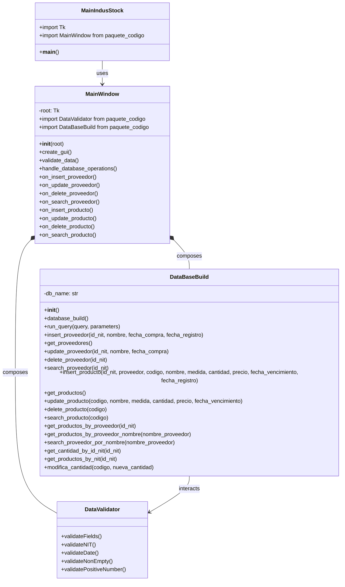
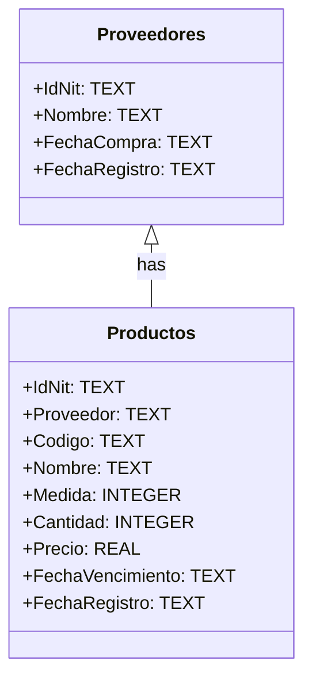
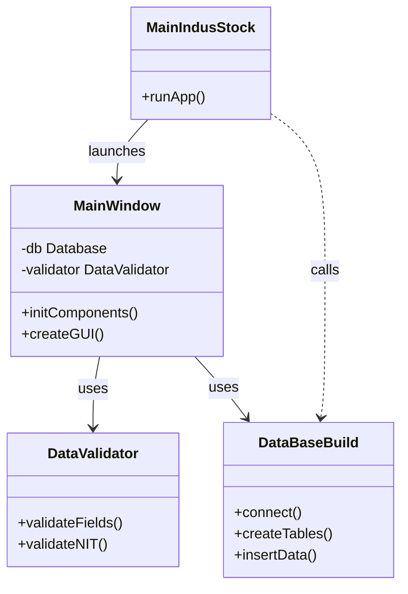

# $MA^3$ IndusStock

**"An undertaking of both obstacles and achievements, bringing forth essential lessons"**

# Planning
### 1. How was the problem addressed?

The inventory management system solution for a warehouse in Python was approached using a modular and object-oriented approach, meeting the conditions set forth:

- Decisions made:

Use of classes: The code was structured in a way that it was not too extensive and sought to apply Object Oriented Programming, in order to model the system (products, inventory, records), in addition to structuring the code for the graphical interface and a SQL database. This facilitated the structure and organization of the code, with each class encapsulating the relevant functionality.

User interface: It was decided to implement the use of the graphical user interface (GUI), by means of Tkinter, since it is included in Python, facilitating the creation of the GUI and improving the interaction with the user by establishing an inventory management very similar to the way it works in many companies.

Data loading and management: The decision was made to use files for data persistence, with methods for massive record loading and report generation.

- Code structure and basic operations:
  
A central class was built to manage the products in the warehouse. This class handles the necessary attributes, such as name, quantity and price, and allows the basic operations of adding, updating, removing and consulting products. The interaction with the system can be done through the console or, optionally, a GUI created with Tkinter to improve usability.

Classes and objects: each product is created as an object with multiple attributes (name, quantity, price, etc.). We made sure that the methods to register inputs and outputs are well implemented to update the inventory in real time.

Inventory listings: A method is included to obtain the current status of the inventory, showing the stored products, their quantities, prices and other relevant attributes.

Bulk loading of records: A method was implemented that allows the loading of multiple products from one file (CSV or similar). This is useful when handling a large volume of data, and was designed to integrate well with the graphical interface.

Data persistence: To ensure that the inventory is maintained between sessions, the data is stored in a SQLite database. This allows any changes to the inventory to be permanently recorded.


- Backend Structure (Inventory Logic)

This part includes the management of inventory data, mainly through SQLite database operations. CRUD operations (create, read, update, delete) are defined here and product persistence is handled.

All the logic related to inventory management is encapsulated here. It allows adding products, removing them, updating them and consulting the inventory based on date filters, categories or any other relevant attribute. It is connected to a SQLite database that stores all records, ensuring data persistence.

All of this is handled directly with SQLite using SQL queries, which ensures that the data is stored in the database file for future sessions.

- Frontend (Graphical Interface with Tkinter)

This is the part that interacts with the user. The interface is built using the MainWindow class, which organizes the different visual components of the application, such as buttons, input fields and labels.

MainWindow class:
This is the main window where the user can view and manage the inventory. This class is connected to the InventoryManager, so every time the user interacts with the interface (for example, adding a product), the backend methods are called. Data entry, action buttons, error handling and validations, updates and more are handled here.

- Workflow
  
When the user interacts with the interface (e.g. by pressing a button to add a product), the interface takes the entered data, validates it and then calls the corresponding backend method. The result of that operation is reflected in the interface, updating the inventory status or displaying the results of a query.

This design clearly separates the application logic and the visual presentation, making the code modular and easy to maintain.

### 2. Diagrams

   a. Class diagrams



   b. Database diagram



The database diagram presents two tables: Suppliers and Products, connected through the IdNit field.

The Suppliers table contains essential information such as Name, PurchaseDate and RecordDate. This unique identifier allows each supplier to be linked to the products it supplies.

The Products table, on the other hand, records details such as Code, Name, Measurement, Quantity, Price, ExpirationDate and RecordDate. Here, the IdNit field functions as a foreign key, associating each product with its corresponding supplier.

The relationship between Suppliers and Products is of the “one-to-many” type, which means that a supplier can have several products associated with it. This is indicated in the diagram by an arrow connecting both tables through the IdNit field. This structure ensures that, for each registered supplier, multiple products can be managed and tracked in the database, allowing efficient inventory control and better traceability of supplies.
 
# Development

The project code is structured in the form of a package as follows:

```
IndusStock/
├── paquete_codigo/
│   ├── __init__.py
│   ├── DataBaseBuild.py
│   ├── DataValidator.py
│   └── MainWindow.py
└── MainIndusStock.py
```


This following diagram reflects how the code is structured, and illustrates the relationships between the different modules of the project as follows:

   - MainIndusStock is the main file that launches the application and interacts with the MainWindow class.
   - MainWindow creates the GUI, validates data using DataValidator, and manages database operations through DataBaseBuild.
   - DataValidator contains validation methods, such as validateFields() and validateNIT().
   - DataBaseBuild includes methods for handling the database, like connect() and createTables().


### DataBaseBuild

The DataBaseBuild module contains the following code, responsible for managing the database in the app. Its primary purpose is to set up and handle an SQLite database that stores all the information about suppliers and products. This module is essential because it handles the structure and operations of the database, which are fundamental to the functionality of your inventory application. Here's a brief explanation of its methods: 

   - **__init__():** Initializes the class and creates the database if it doesn't exist. This ensures that the database is always available when the application starts, allowing you to store information.

   - **database_build():** This function creates the Proveedores and Productos tables if they do not exist in the database. It is essential for structuring the database and enabling proper data insertion and retrieval. The tables are defined with fields such as IdNit, Nombre, Codigo, Cantidad, Precio, etc., which help organize the information in a clear and structured way.

   - **run_query(query, parameters=()):** Executes generic SQL queries in the database, such as SELECT, INSERT, UPDATE, and DELETE.
This function is important because it centralizes the execution of SQL queries, making code reusable and database handling efficient.

   - **Supplier Operations:** Methods like *insert_proveedor()*, *get_proveedores()*, *update_proveedor()*, *delete_proveedor()*, and *search_proveedor()* manage supplier information: Insert new suppliers, retrieve all suppliers or a specific one, update supplier details, delete suppliers from the database.

   - **Product Operations:** Methods like *insert_producto()*, *get_productos()*, *update_producto()*, *delete_producto()*, and *search_producto()* manage products similarly to suppliers. Additional functions like *get_productos_by_proveedor()* and *get_productos_by_proveedor_nombre()* allow retrieving products associated with a supplier, either by their IdNit or their name.

   - **modifica_cantidad():** Updates the quantity of a specific product. This is crucial for keeping the product inventory up to date.

In summary this module encapsulates all the logic related to creating, updating, querying, and deleting data in the database. This ensures that interactions with the database are structured and easy to maintain. By centralizing query execution in the run_query() function, you can reuse the same code to execute multiple types of queries, improving efficiency and reducing code duplication. With validations like foreign key relationships (e.g., FOREIGN KEY(IdNit) in the Productos table), the relationship between suppliers and products is properly structured, ensuring that products are not inserted for nonexistent suppliers.

```python
# Aqui codigo primer modulo
```

### DataValidator

On the other hand DataValidator class is responsible for validating various types of data entered into the system, ensuring their compliance with the established rules. Its main methods include no_spaces, which verifies that a text does not contain spaces.  In addition, it has methods such as is_float and is_integer, which determine whether a text can be converted to a decimal or integer number, respectively.

The DataValidator class is used to ensure that the data entered into the inventory management system is valid and complies with certain formatting and content rules. Its main function is to prevent errors and guarantee the integrity of the information.

Also, the class includes a method called is_valid_date, which validates the date format (dd/mm/yyyy) and checks if it is a valid date. There is also a method to check if a size is a valid number, called is_valid_size.

On the other hand, the class presents specific validation methods, such as validate_id_nit, validate_supplier_name and validate_purchase_date, among others. These methods apply the general validation functions to check specific supplier and product data, providing clear error messages when the validation is not fulfilled.

```python
# Aqui codigo segundo modulo
```

### MainWindow

The last module: MainWindow, contains the following code, responsible for creating..... # Poner aqui la explicación de lo que hace esta tercera clase del modulo

```python
# Aqui codigo tercer modulo
```

### MainIndusStock

In the main file: MainIndusStock serves as the entry point of the inventory management application. It initializes the GUI and manages the main event loop, allowing users to interact with the application.

```python
# MainIndusStock.py

from tkinter import Tk
from paquete_codigo.MainWindow import MainWindow

if __name__ == "__main__":
    root = Tk()
    app = MainWindow(root)
    root.mainloop()
```

# How to install and use the program

      # Escribir aqui como se instala el programa, OJO: INCLUIR LO DEL ENTORNO VIRTUAL EJEMPLO SEGÚN IA: 
      PASO A PASO
      - Crea el entorno virtual con `python -m venv venv`.
      - Actívalo con `venv\Scripts\activate` o `source venv/bin/activate` según tu sistema operativo.
      - Instala las dependencias con `pip install -r requirements.txt`.
      - Incluye estas instrucciones en tu `README.md`.
      De esta forma, tendrás un entorno virtual controlado, y cualquier persona que use tu código podrá replicar tu entorno sin problemas.
