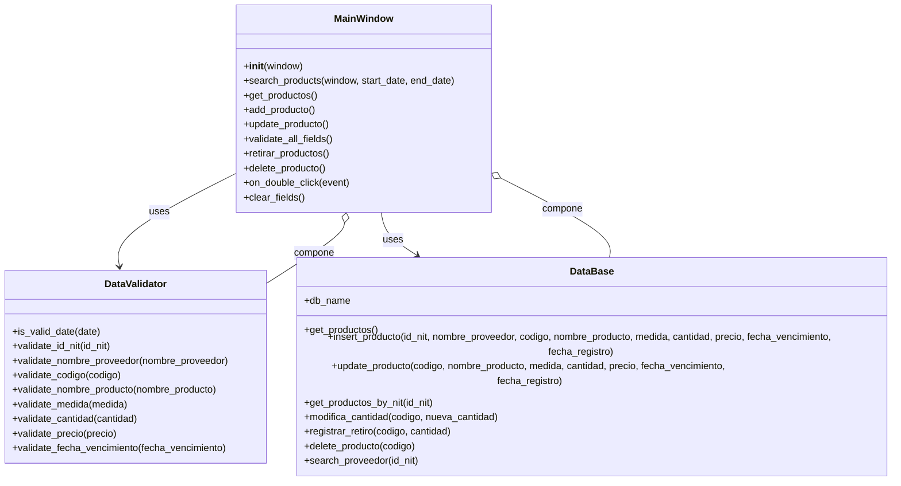
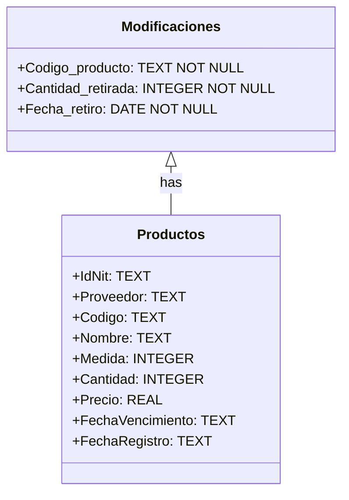
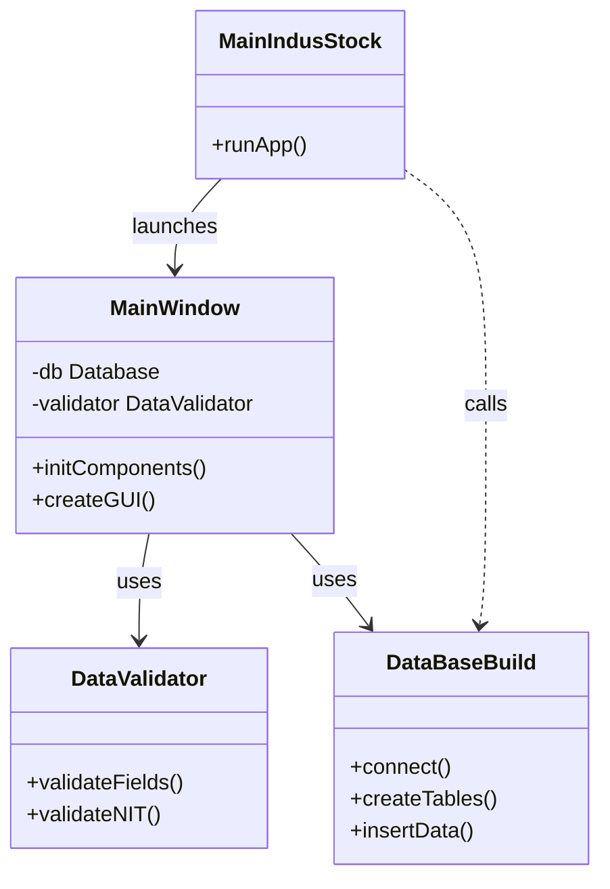

# $MA^3$ IndusStock

**"An undertaking of both obstacles and achievements, bringing forth essential lessons"**

# Planning
### 1. How was the problem addressed?

The inventory management system solution for a warehouse in Python was approached using a modular and object-oriented approach, meeting the conditions set forth:

- Decisions made:

Use of classes: The code was structured in a way that it was not too extensive and sought to apply Object Oriented Programming, in order to model the system (products, inventory, records), in addition to structuring the code for the graphical interface and a SQL database. This facilitated the structure and organization of the code, with each class encapsulating the relevant functionality.

User interface: It was decided to implement the use of the graphical user interface (GUI), by means of Tkinter, since it is included in Python, facilitating the creation of the GUI and improving the interaction with the user by establishing an inventory management very similar to the way it works in many companies.

Data loading and management: The decision was made to use files for data persistence, with methods for massive record loading and report generation.

- Code structure and basic operations:
  
A central class was built to manage the products in the warehouse. This class handles the necessary attributes, such as name, quantity and price, and allows the basic operations of adding, updating, removing and consulting products. The interaction with the system can be done through the console or, optionally, a GUI created with Tkinter to improve usability.

Classes and objects: each product is created as an object with multiple attributes (name, quantity, price, etc.). We made sure that the methods to register inputs and outputs are well implemented to update the inventory in real time.

Inventory listings: A method is included to obtain the current status of the inventory, showing the stored products, their quantities, prices and other relevant attributes.

Bulk loading of records: A method was implemented that allows the loading of multiple products from one file (CSV or similar). This is useful when handling a large volume of data, and was designed to integrate well with the graphical interface.

Data persistence: To ensure that the inventory is maintained between sessions, the data is stored in a SQLite database. This allows any changes to the inventory to be permanently recorded.

- Backend Structure (Inventory Logic)

This part includes the management of inventory data, mainly through SQLite database operations. CRUD operations (create, read, update, delete) are defined here and product persistence is handled.

All the logic related to inventory management is encapsulated here. It allows adding products, removing them, updating them and consulting the inventory based on date filters, categories or any other relevant attribute. It is connected to a SQLite database that stores all records, ensuring data persistence.

All of this is handled directly with SQLite using SQL queries, which ensures that the data is stored in the database file for future sessions.

- Frontend (Graphical Interface with Tkinter)

This is the part that interacts with the user. The interface is built using the MainWindow class, which organizes the different visual components of the application, such as buttons, input fields and labels.

MainWindow class:
This is the main window where the user can view and manage the inventory. This class is connected to the InventoryManager, so every time the user interacts with the interface (for example, adding a product), the backend methods are called. Data entry, action buttons, error handling and validations, updates and more are handled here.

- Workflow
  
When the user interacts with the interface (e.g. by pressing a button to add a product), the interface takes the entered data, validates it and then calls the corresponding backend method. The result of that operation is reflected in the interface, updating the inventory status or displaying the results of a query.

This design clearly separates the application logic and the visual presentation, making the code modular and easy to maintain.

### 2. Diagrams

   a. Class diagrams



   b. Database diagram



The Modifications table contains essential information such as the modified product code, the quantity withdrawn and the date of withdrawal. This identifier allows each modification to be linked to the product to which it corresponds.

On the other hand, the Products table records details such as code, name, measure, quantity, price, expiration date and registration date. Here, the Product_Code field acts as a foreign key that associates each modification with its corresponding product.

The relationship between Products and Modifications is of the “one-to-many” type, meaning that a product can have several modifications associated with it. This is indicated in the diagram by an arrow connecting both tables through the Product_Code field. This structure allows to efficiently manage and track the modifications made to each product, improving inventory control and traceability of changes.

# Development

The project code is structured in the form of a package as follows:

```
IndusStock/
├── env/
├── src/
|   ├── paquete_codigo/
│       ├── __init__.py
│       ├── DataBaseBuild.py
│       ├── DataValidator.py
│       └── MainWindow.py
|    └── MainIndusStock.py
└── manejo-inventario.db
```


This following diagram reflects how the code is structured, and illustrates the relationships between the different modules of the project as follows:

   - MainIndusStock is the main file that launches the application and interacts with the MainWindow class.
   - MainWindow creates the GUI, validates data using DataValidator, and manages database operations through DataBaseBuild.
   - DataValidator contains validation methods, such as validateFields() and validateNIT().
   - DataBaseBuild includes methods for handling the database, like connect() and createTables().


### DataBaseBuild

The DataBaseBuild module is responsible for managing the SQLite database that stores information about products and their modifications within the inventory management application. This module is essential for ensuring the integrity and structure of the database, as well as providing methods to interact with and manipulate data effectively.

*Key Methods and Responsibilities:*
  - **__init__():** The constructor initializes the class and ensures that the database file is created if it doesn't already exist. It calls database_build() to set up the database structure, ensuring that all necessary tables are available when the application starts.

  - **database_build():** This method creates two important tables in the SQLite database:
      * **Modificaciones:** Records details about product withdrawals, including the product code, the quantity withdrawn, and the date of withdrawal. It is linked to the Productos table via a foreign key (Codigo_producto), ensuring that the withdrawal is tied to an existing product.
      * **Productos:** Stores information about each product, such as its code (primary key), name, unit of measure, quantity, price, expiration date, and registration date. This table is the core of the inventory, where all product-related data is managed.

  - **run_query(query, parameters=()):** A utility method that centralizes the execution of SQL queries. It takes a SQL query string and optional parameters, executes the query, and commits the changes if required. This method helps reduce code duplication and enhances the reusability of SQL operations.

  - **registrar_retiro(codigo_producto, cantidad_retirada):** This method registers a product withdrawal by inserting a record into the Modificaciones table. It records the product code, the quantity withdrawn, and the current date and time of the withdrawal, ensuring that the stock levels are updated accordingly.

  - **Foreign Key Relationship:** The Modificaciones table has a foreign key (Codigo_producto) that references the Codigo field in the Productos table. This relationship ensures that modifications are only made for existing products, maintaining data integrity.

*Product Operations:*

These methods provide various CRUD (Create, Read, Update, Delete) functionalities for managing products in the inventory:

  - **insert_producto():** Inserts a new product into the Productos table with details such as code, name, unit of measure, quantity, price, expiration date, and registration date.
  - **get_productos():** Retrieves all products stored in the Productos table.
  - **update_producto():** Updates the information of an existing product, such as its name, unit of measure, quantity, price, expiration date, and registration date.
  - **delete_producto():** Deletes a product based on its code (Codigo).
  - **search_producto():** Searches for a product by its code.
  - **modifica_cantidad():** Updates the quantity of a product, ensuring accurate inventory levels.

In summary, the DataBaseBuild module encapsulates all database-related logic. It provides methods for creating, updating, and retrieving product data, as well as registering stock withdrawals. By managing the tables for products and modifications, this module ensures that the inventory data is accurate and up to date, supporting the overall functionality of the inventory management system.

```python
# DataBaseBuild.py

import tkinter as tk                            # Used to create GUI
from tkinter import Toplevel                    # 
from tkinter import ttk, messagebox as mssg     # Provides a set of widgets, display dialog boxes, 
import sqlite3                                  # Python library for interacting with SQLite databases
import datetime
from datetime import datetime                   # Provides classes for working with dates and times in Python.

class DataBaseBuild:
    def __init__(self):
        # Name of the database file
        self.db_name = 'manejo-inventario.db'
        # Create the database file if it doesn't exist
        self.database_build()
    
    def database_build(self):  
        # Establish a connection to the database 
        with sqlite3.connect(self.db_name) as conn:
            
            # In order to interact with the database.
            cursor = conn.cursor()
            
            #Execute an SQL query to create 'Modificaiones' table if it does not exist
            cursor.execute("""
                CREATE TABLE IF NOT EXISTS Modificaciones (
                    id INTEGER PRIMARY KEY AUTOINCREMENT,
                    Codigo_producto TEXT NOT NULL,
                    Cantidad_retirada INTEGER NOT NULL,
                    Fecha_retiro DATE NOT NULL,
                    FOREIGN KEY (Codigo_producto) REFERENCES Productos(IdNit)
                
                )
            """)
            
            # Execute an SQL query to create the 'Productos' table if it does not exist.
            cursor.execute("""
                CREATE TABLE IF NOT EXISTS Productos (
                    IdNit TEXT,
                    Proveedor TEXT,
                    Codigo TEXT PRIMARY KEY,
                    Nombre TEXT,
                    Medida INTEGER,
                    Cantidad INTEGER,
                    Precio REAL,
                    FechaVencimiento TEXT,
                    FechaRegistro TEXT,
                    FOREIGN KEY(IdNit) REFERENCES Proveedores(IdNit)
                )
            """)
            
            # Commit the changes made to the database.
            conn.commit()

    def registrar_retiro(self, codigo_producto, cantidad_retirada):
    # Establecer la conexión a la base de datos
        with sqlite3.connect(self.db_name) as conn:
            cursor = conn.cursor()

        # Registrar la fecha y hora actual del retiro
            fecha_retiro = datetime.now().strftime("%Y-%m-%d %H:%M:%S")

        # Insertar los datos en la tabla Modificaciones
            cursor.execute("""
                INSERT INTO Modificaciones (Codigo_producto, Cantidad_retirada, Fecha_retiro)
                VALUES (?, ?, ?)
            """, (codigo_producto, cantidad_retirada, fecha_retiro))

        # Confirmar los cambios
            conn.commit()
    
    def run_query(self, query, parameters=()):
        # Open a connection to the SQLite database 
        with sqlite3.connect(self.db_name) as conn:
            # Create a cursor 
            cursor = conn.cursor()
            
            # Execute the SQL query with the provided parameters
            # query: SELECT, INSERT, UPDATE, DELETE. The action
            # parameters: the values
            result = cursor.execute(query, parameters)
            
            # Commit the transaction to save changes to the database (e.g., INSERT, UPDATE, DELETE)
            conn.commit()
        
        # Return the result of the executed query
        return result

    # Product operations

    def insert_producto(self, id_nit, proovedor, codigo, nombre, medida, cantidad, precio, fecha_vencimiento,fecha_registro=datetime.now()):
        query = 'INSERT INTO Productos VALUES (?, ?, ?, ?, ?, ?, ?, ?, ?)'
        parameters = (id_nit, proovedor, codigo, nombre, medida, cantidad, precio, fecha_vencimiento, fecha_registro)
        self.run_query(query, parameters)

    def get_productos(self):
        query = 'SELECT * FROM Productos'
        return self.run_query(query)

    def update_producto(self, codigo, nombre, medida, cantidad, precio, fecha_vencimiento, fecha_registro):
    # Consulta SQL para actualizar el producto
        query = '''
            UPDATE Productos 
            SET Nombre = ?, Medida = ?, Cantidad = ?, Precio = ?, FechaVencimiento = ?, FechaRegistro = ?
            WHERE Codigo = ?
        '''
        parameters = (nombre, medida, cantidad, precio, fecha_vencimiento, fecha_registro, codigo)

    # Establecer conexión a la base de datos
        with sqlite3.connect(self.db_name) as conn:
            cursor = conn.cursor()
            cursor.execute(query, parameters)

        # Verificar cuántas filas fueron afectadas
            filas_afectadas = cursor.rowcount
            print(f"Filas afectadas por la actualización: {filas_afectadas}")

        # Confirmar la transacción
            conn.commit()

        return filas_afectadas

    def delete_producto(self, codigo):
        query = 'DELETE FROM Productos WHERE Codigo = ?'
        self.run_query(query, (codigo,))

    def search_producto(self, codigo):
        query = 'SELECT * FROM Productos WHERE Codigo = ?'
        return self.run_query(query, (codigo,))

    def get_productos_by_proveedor(self, id_nit):
        query = 'SELECT * FROM Productos WHERE IdNit = ?'
        return self.run_query(query, (id_nit,))

    def get_productos_by_proveedor_nombre(self, nombre_proveedor):
        # Ejecuta una consulta para obtener productos según el nombre del proveedor
        query = """
        SELECT * FROM Productos
        WHERE IdNit IN (
            SELECT IdNit FROM Proveedores WHERE Nombre = ?
        )
        """
        return self.run_query(query, (nombre_proveedor,))

    def search_proveedor_por_nombre(self, nombre_proveedor):
        # Ejecuta una consulta para obtener detalles del proveedor por nombre
        query = """
        SELECT * FROM Proveedores
        WHERE Nombre = ?
        """
        return self.run_query(query, (nombre_proveedor,))
    
    def get_cantidad_by_id_nit(self, id_nit):
        query = 'SELECT * FROM Productos WHERE IdNit = ?'
        result = self.run_query(query, (id_nit,))
        # Fetch all products associated with the given IdNit
        productos = result.fetchall()  # Return all matching products as a list
        return productos if productos else None  # Return the list or None if no products are found

    def get_productos_by_nit(self, id_nit):
        query = 'SELECT * FROM Productos WHERE IdNit = ?'
        result = self.run_query(query, (id_nit,))
        return result.fetchall()  # Devuelve todos los productos asociados al ID NIT

    def modifica_cantidad(self, codigo, nueva_cantidad):
        # Abre una conexión a la base de datos
        with sqlite3.connect(self.db_name) as conn:
            # Crear un cursor para ejecutar la consulta
            cur = conn.cursor()

            # Consulta SQL para actualizar la cantidad del producto
            sql = '''
                UPDATE Productos
                SET Cantidad = ?
                WHERE Codigo = ?
            '''
            
            # Ejecutar la consulta con los parámetros correspondientes
            cur.execute(sql, (nueva_cantidad, codigo))

            # Obtener el número de filas afectadas
            n = cur.rowcount

            # Confirmar los cambios (commit ya está implícito con el 'with')
            conn.commit()

            # Cerrar el cursor (esto es automático al salir del 'with')

            # Devolver el número de filas afectadas
            return n

```

### DataValidator

On the other hand DataValidator class is responsible for validating various types of data entered into the system, ensuring their compliance with the established rules. Its main methods include no_spaces, which verifies that a text does not contain spaces.  In addition, it has methods such as is_float and is_integer, which determine whether a text can be converted to a decimal or integer number, respectively.

The DataValidator class is used to ensure that the data entered into the inventory management system is valid and complies with certain formatting and content rules. Its main function is to prevent errors and guarantee the integrity of the information.

Also, the class includes a method called is_valid_date, which validates the date format (dd/mm/yyyy) and checks if it is a valid date. There is also a method to check if a size is a valid number, called is_valid_size.

On the other hand, the class presents specific validation methods, such as validate_id_nit, validate_supplier_name and validate_purchase_date, among others. These methods apply the general validation functions to check specific supplier and product data, providing clear error messages when the validation is not fulfilled.

```python
# DataValidator.py

import datetime
from datetime import datetime                   # Provides classes for working with dates and times in Python.

class DataValidator:
    def __init__(self):
        pass                # This class does not perform any actions

    def no_spaces(self, text):
        # Check if there is at least one space in the text
        if ' ' in text:
            return False  
        else:
            return True   

    def max_length(self, text, length):
        # Check if the length of the provided text does not exceed the specified length
        text_length = len(text)  # Get the length of the text
        if text_length <= length:
            return True  
        else:
            return False 

    # Function to check if the provided text can be converted to a float
    def is_float(self, text):
        # Check if the provided text can be converted to a float
        if text == "-":
            return True
        try:
            # Try to convert the text to a float
            float_value = float(text)
            return True
        except ValueError:
            return False

    # Function to check if the provided text can be converted to an integer
    def is_integer(self, text):
        # Check if the provided text can be converted to an integer
        try:
            int(text)
            return True
        except ValueError:
            return False
        
    def is_valid_date(self, date_text):
        # Check if the length of date_text is 10 characters and format is 'dd/mm/yyyy'
        if date_text == "-/-/-":
            return True
        
        if len(date_text) != 10 or date_text[2] != '/' or date_text[5] != '/':
            return False

        # Extract day, month, and year parts from the date_text
        day_str = date_text[:2]
        month_str = date_text[3:5]
        year_str = date_text[6:]

        # Check if day, month, and year are all numeric
        if not (day_str.isdigit() and month_str.isdigit() and year_str.isdigit()):
            return False

        day = int(day_str)
        month = int(month_str)
        year = int(year_str)

        try:
            # Attempt to create a datetime object with the provided date
            datetime(year, month, day)
            return True
        except ValueError:
            return False
    
    def validate_id_nit(self, id_nit):
            if not self.no_spaces(id_nit):
                return "El ID NIT no debe contener espacios."
            return None

    def validate_nombre_proveedor(self, nombre):
        if not self.max_length(nombre, 25):
            return "El Nombre del Proveedor no debe exceder 25 caracteres."
        return None

    def validate_codigo(self, codigo):
        if not self.no_spaces(codigo):
            return "El Código no debe contener espacios."
        return None

    def validate_nombre_producto(self, nombre):
        if not self.max_length(nombre, 50):
            return "El Nombre del Producto no debe exceder 50 caracteres."
        return None

    def validate_cantidad(self, cantidad):
        if not self.is_integer(cantidad):
            return "La Cantidad debe ser un número entero."
        return None
    
    def validate_medida(self, medida):
        
        if not self.is_float(medida) :
            return "La medida debe ser un número"
        return None
   
    def validate_precio(self, precio):
        try:
            # Intentar convertir el precio a un número flotante
            float(precio)
            return None
        except ValueError:
            return "El Precio debe ser un número."

    def validate_fecha_vencimiento(self, fecha):
        if not self.is_valid_date(fecha):
            return "La Fecha de Vencimiento no es válida. Use el formato dd/mm/yyyy."
        return None

```

### MainWindow

The last module: MainWindow, contains the following code, and is responsible for managing the graphical user interface (GUI) of the inventory management application. It integrates various functionalities for product management, including searching, adding, updating, and removing products, as well as displaying information in a structured manner through a Treeview widget. This module plays a critical role in ensuring that users can interact seamlessly with the underlying database and perform inventory operations efficiently.

*Key Methods and Responsibilities:*

  - **open_db_window():** This method creates a new window for interacting with the database. It includes fields for entering start and end dates to filter product records based on their registration date. The method also sets up a Treeview widget to display the results of the search, ensuring that the interface is user-friendly and informative.
    
  - **search_products(window, start_date, end_date):** This method retrieves products from the database within a specified date range. It validates the date format and executes a SQL query to fetch records from the Productos table. Results are displayed in the Treeview, and appropriate error messages are shown if there are issues with the input.

  - **get_productos():** This method populates the main Treeview with products retrieved from the database. It clears any existing entries to ensure that the displayed data is current, providing a clear overview of the inventory.
    
  - **add_producto():** Responsible for adding a new product to the database, this method validates input fields before calling the database’s insertion method. It updates the displayed product list and clears input fields after a successful operation.
    
  - **update_producto():** This method updates an existing product’s details in the database. It validates input fields and uses the database’s update function to modify records. Users receive confirmation of successful updates, enhancing user experience.
    
  - **validate_all_fields():** This method consolidates validation logic for all input fields, ensuring that the data entered by the user adheres to the specified rules. It returns a boolean indicating whether all validations passed, thus guiding the flow of data entry.
    
  - **retirar_productos():** This method handles product withdrawals by validating the ID NIT and quantity to withdraw. It checks the existing inventory levels before performing updates, ensuring that the stock data remains accurate and that users are informed of any discrepancies.
    
  - **delete_producto():** This method allows users to remove a product from the inventory. It prompts for confirmation before executing the deletion, safeguarding against accidental removals. It also refreshes the product list afterward to reflect the latest state of the inventory.
    
  - **on_double_click(event):** This method facilitates editing of product details when a user double-clicks an item in the Treeview. It populates the input fields with the selected product's information, making it easier for users to modify existing records.
    
  - **clear_fields():** This utility method resets all input fields to their default state, improving usability by allowing users to start fresh after completing actions.

In summary, the MainWindow module encapsulates the GUI logic for the inventory management application. It integrates various functionalities to search, add, update, and delete product records, while also ensuring a smooth user experience through validations and feedback mechanisms. By managing user interactions with the database, this module plays a crucial role in maintaining an accurate and user-friendly inventory management system.

```python
# MainWindow.py

import tkinter as tk                            # Used to create GUI
from tkinter import Toplevel                    # 
from tkinter import ttk, messagebox as mssg     # Provides a set of widgets, display dialog boxes, 
import sqlite3                                  # Python library for interacting with SQLite databases
import datetime
from datetime import datetime                   # Provides classes for working with dates and times in Python.
from .DataValidator import DataValidator
from .DataBaseBuild import DataBaseBuild

class MainWindow:
    def __init__(self, window):
        self.wind = window
        self.wind.title("Sistema de Inventario")
        self.wind.geometry('1000x700')
        self.wind.resizable(False, False)
       
        # Initialize Database and Validator
        self.db = DataBaseBuild()
        self.validator = DataValidator()

        # Set up the UI
        self.setup_GUI()

        # Populate initial data
        self.get_productos()

    def setup_GUI(self):
        frame = tk.LabelFrame(self.wind, text="Registrar Nuevo Producto")
        frame.grid(row=0, column=0, padx=20, pady=10)

    # Labels and Entries
        tk.Label(frame, text="ID NIT:").grid(row=0, column=0, pady=5, padx=5, sticky='e')
        self.id_nit = tk.Entry(frame)
        self.id_nit.grid(row=0, column=1, pady=5, padx=5)
        #self.id_nit.bind("<FocusOut>", self.validate_id_nit)

        tk.Label(frame, text="Nombre Proveedor:").grid(row=1, column=0, pady=5, padx=5, sticky='e')
        self.nombre_proveedor = tk.Entry(frame)
        self.nombre_proveedor.grid(row=1, column=1, pady=5, padx=5)
        #self.nombre_proveedor.bind("<FocusOut>", self.validate_nombre_proveedor)

        tk.Label(frame, text="Código Producto:").grid(row=3, column=0, pady=5, padx=5, sticky='e')
        self.codigo = tk.Entry(frame)
        self.codigo.grid(row=3, column=1, pady=5, padx=5)
        #self.codigo.bind("<FocusOut>", self.validate_codigo)

        tk.Label(frame, text="Nombre Producto:").grid(row=4, column=0, pady=5, padx=5, sticky='e')
        self.nombre_producto = tk.Entry(frame)
        self.nombre_producto.grid(row=4, column=1, pady=5, padx=5)
        #self.nombre_producto.bind("<FocusOut>", self.validate_nombre_producto)

        tk.Label(frame, text="""Medida:\nSi no aplica ingrese: "-" """).grid(row=5, column=0, pady=5, padx=5, sticky='e')
        self.medida = tk.Entry(frame)
        self.medida.grid(row=5, column=1, pady=5, padx=5)
        #self.medida.bind("<FocusOut>", self.validate_medida)

        tk.Label(frame, text="Cantidad:").grid(row=6, column=0, pady=5, padx=5, sticky='e')
        self.cantidad = tk.Entry(frame)
        self.cantidad.grid(row=6, column=1, pady=5, padx=5)
        #self.cantidad.bind("<FocusOut>", self.validate_cantidad)

        tk.Label(frame, text="Precio:").grid(row=7, column=0, pady=5, padx=5, sticky='e')
        self.precio = tk.Entry(frame)
        self.precio.grid(row=7, column=1, pady=5, padx=5)
        #self.precio.bind("<FocusOut>", self.validate_precio)

        tk.Label(frame, text="""Fecha Vencimiento (dd/mm/yyyy):\n Si no aplica ingrese: "-/-/-" """).grid(row=8, column=0, pady=5, padx=5, sticky='e')
        self.fecha_vencimiento = tk.Entry(frame)
        self.fecha_vencimiento.grid(row=8, column=1, pady=5, padx=5)
        self.fecha_vencimiento.insert(0, 'dd/mm/yyyy')
        self.fecha_vencimiento.bind("<FocusIn>", lambda e: self.fecha_vencimiento.delete(0, tk.END))
        #self.fecha_vencimiento.bind("<FocusOut>", self.validate_fecha_vencimiento)

    # Fiel from date of registration
        tk.Label(frame, text="Fecha Registro (dd/mm/yyyy):").grid(row=9, column=0, pady=5, padx=5, sticky='e')
    
    # Get actual day in format dd/mm/yyyy
        fecha_hoy = datetime.now().strftime("%d/%m/%Y")
    
        self.fecha_registro = tk.Entry(frame)
        self.fecha_registro.grid(row=9, column=1, pady=5, padx=5)
    
    # Insert current date automatically
        self.fecha_registro.insert(0, fecha_hoy)

        ttk.Button(frame, text="Guardar Producto", command=self.add_producto).grid(row=10, column=0, pady=10, padx=5)
        ttk.Button(frame, text="Actualizar Producto", command=self.update_producto).grid(row=10, column=1, pady=10, padx=5)
        ttk.Button(frame, text="Retirar Productos", command=self.retirar_productos).grid(row=11, column=0, pady=10, padx=5)
        ttk.Button(frame, text="Eliminar Producto", command=self.delete_producto).grid(row=11, column=1, pady=10, padx=5)
        ttk.Button(frame, text="Limpiar Campos", command=self.clear_fields).grid(row=12, column=0, pady=10, padx=5)
        ttk.Button(frame, text="Mirar Base de Datos", command=self.open_db_window).grid(row=12, column=1, pady=10, padx=5)
        ttk.Button(frame, text="Ver Retiros", command=self.mostrar_modificaciones).grid(row=13, column=0, pady=10, padx=5)
      
        # Treeview
        
        self.tree = ttk.Treeview(self.wind, columns=("IdNit", "Proveedor", "Codigo", "Nombre", "Medida", "Cantidad", "Precio", "FechaVencimiento","FechaRegistro"), show='headings')
        self.tree.heading("IdNit", text="ID NIT")
        self.tree.heading("Proveedor", text="Proveedor")
        self.tree.heading("Codigo", text="Código")
        self.tree.heading("Nombre", text="Nombre")
        self.tree.heading("Medida", text="Medida gr/l")
        self.tree.heading("Cantidad", text="Cantidad")
        self.tree.heading("Precio", text="Precio")
        self.tree.heading("FechaVencimiento", text="F/Vencimiento")
        self.tree.heading("FechaRegistro", text="F/Registro")
        self.tree.column("IdNit", width=80)
        self.tree.column("Proveedor", width=120)
        self.tree.column("Codigo", width=80)
        self.tree.column("Nombre", width=120)
        self.tree.column("Medida", width=80)
        self.tree.column("Cantidad", width=80)
        self.tree.column("Precio", width=80)
        self.tree.column("FechaVencimiento", width=100)
        self.tree.heading("FechaRegistro", text="F/Registro")
        self.tree.grid(row=1, column=0, columnspan=2, padx=20, pady=10)
        self.tree.bind("<Double-1>", self.on_double_click)
    
    def mostrar_modificaciones(self):
    # Create a new window to display the modifications
        ventana_modificaciones = Toplevel()
        ventana_modificaciones.title("Historial de Modificaciones")

    # Create a table (treeview) to display the data
        tree = ttk.Treeview(ventana_modificaciones, columns=("Codigo", "Cantidad", "Fecha"), show="headings")
        tree.heading("Codigo", text="Código Producto")
        tree.heading("Cantidad", text="Cantidad Retirada")
        tree.heading("Fecha", text="Fecha de Retiro")

    # Connect to the database and get the records of the Modifications table.
        with sqlite3.connect(self.db.db_name) as conn:
            cursor = conn.cursor()
            cursor.execute("SELECT Codigo_producto, Cantidad_retirada, Fecha_retiro FROM Modificaciones")
            for row in cursor.fetchall():
                tree.insert("", "end", values=row)

    # Show the table
        tree.pack(fill=tk.BOTH, expand=True)

        def validate_id_nit(self, event):
            error_message = self.validator.validate_id_nit(self.id_nit.get())
            if error_message:
                mssg.showerror("Error", error_message)
                self.id_nit.focus_set()
                return False
            return True
   
    def validate_id_nit(self, event):
        error_message = self.validator.validate_id_nit(self.id_nit.get())
        if error_message:
            mssg.showerror("Error", error_message)
            self.id_nit.focus_set()
            return False
        return True
    
    def validate_nombre_proveedor(self, event):
        error_message = self.validator.validate_nombre_proveedor(self.nombre_proveedor.get())
        if error_message:
            mssg.showerror("Error", error_message)
            self.nombre_proveedor.focus_set()
            return False
        return True

    def validate_codigo(self, event):
        error_message = self.validator.validate_codigo(self.codigo.get())
        if error_message:
            mssg.showerror("Error", error_message)
            self.codigo.focus_set()
            return False
        return True

    def validate_nombre_producto(self, event):
        error_message = self.validator.validate_nombre_producto(self.nombre_producto.get())
        if error_message:
            mssg.showerror("Error", error_message)
            self.nombre_producto.focus_set()
            return False
        return True

    def validate_medida(self, event):
        error_message = self.validator.validate_medida(self.medida.get())
        if error_message:
            mssg.showerror("Error", error_message)
            self.medida.focus_set()
            return False
        return True

    def validate_cantidad(self, event):
        error_message = self.validator.validate_cantidad(self.cantidad.get())
        if error_message:
            mssg.showerror("Error", error_message)
            self.cantidad.focus_set()
            return False
        return True

    def validate_precio(self, event):
        error_message = self.validator.validate_precio(self.precio.get())
        if error_message:
            mssg.showerror("Error", error_message)
            self.precio.focus_set()
            return False
        return True

    def validate_fecha_vencimiento(self, event):
        error_message = self.validator.validate_fecha_vencimiento(self.fecha_vencimiento.get())
        if error_message:
            mssg.showerror("Error", error_message)
            self.fecha_vencimiento.focus_set()
            return False
        return True

    # Methods with the DataBase
    
    def open_db_window(self):
    # Create a new window  
        new_window = Toplevel(self.wind)
        new_window.title("Base de Datos")
        new_window.geometry("800x700")

    # Assign an event handler so that the Treeview is correctly destroyed when the window is closed
        def on_close():
        # Destroy the sub-window and clean the associated widgets
            new_window.destroy()

        new_window.protocol("WM_DELETE_WINDOW", on_close)  # Configure the correct closing of the window

    # Labels and input fields for dates
        tk.Label(new_window, text="Fecha Inicio (DD-MM-YYYY):").pack(pady=5)                                  
        start_date_entry = tk.Entry(new_window)
        start_date_entry.pack(pady=5)

        tk.Label(new_window, text="Fecha Fin (DD-MM-YYYY):").pack(pady=5)
        end_date_entry = tk.Entry(new_window)
        end_date_entry.pack(pady=5)

        search_button = tk.Button(new_window, text="Buscar Productos", 
                                command=lambda: self.search_products(new_window, start_date_entry.get(), end_date_entry.get()))
        search_button.pack(pady=10)

    # Table to show results
        self.tree_db_window = ttk.Treeview(new_window, columns=("ID NIT", "Proveedor", "Medida gr/l", "Cantidad", "Precio", "F/Vencimiento", "F/Registro"), show='headings')

    # Define column headers and widths
        self.tree_db_window.heading("ID NIT", text="ID NIT")
        self.tree_db_window.heading("Proveedor", text="Proveedor")
        self.tree_db_window.heading("Medida gr/l", text="Medida gr/l")
        self.tree_db_window.heading("Cantidad", text="Cantidad")
        self.tree_db_window.heading("Precio", text="Precio")
        self.tree_db_window.heading("F/Vencimiento", text="F/Vencimiento")
        self.tree_db_window.heading("F/Registro", text="F/Registro")

    # Set column widths
        self.tree_db_window.column("ID NIT", width=100)
        self.tree_db_window.column("Proveedor", width=150)
        self.tree_db_window.column("Medida gr/l", width=100)
        self.tree_db_window.column("Cantidad", width=100)
        self.tree_db_window.column("Precio", width=100)
        self.tree_db_window.column("F/Vencimiento", width=120)
        self.tree_db_window.column("F/Registro", width=120)

        self.tree_db_window.pack(fill="both", expand=True, pady=20)
    
    def search_products(self, window, start_date, end_date):
        validator = DataValidator()

    # Verify that dates have the correct format using the is_valid_date function.
        if not validator.is_valid_date(start_date) or not validator.is_valid_date(end_date):
            mssg.showerror("Error", "Por favor ingresa las fechas en formato DD/MM/YYYY.")
            return

        try:
        # Convert dates to the appropriate format
            start_date_obj = datetime.strptime(start_date, '%d/%m/%Y')
            end_date_obj = datetime.strptime(end_date, '%d/%m/%Y')

        # Connect to the database and run the query
            conn = sqlite3.connect(self.db.db_name)
            cursor = conn.cursor()

            query = """
            SELECT IdNit, Proveedor, Medida, Cantidad, Precio, FechaVencimiento, FechaRegistro
            FROM Productos
            WHERE FechaRegistro BETWEEN ? AND ?
            """
            cursor.execute(query, (start_date, end_date))
            productos = cursor.fetchall()
            conn.close()

        # Clear the table before inserting new results
            for row in self.tree_db_window.get_children():
                self.tree_db_window.delete(row)

        # Insert the products in the Treeview if they are within the date range
            for producto in productos:
                self.tree_db_window.insert("", "end", values=producto)

        except sqlite3.Error as e:
            mssg.showerror("Error", f"Error al conectarse a la base de datos: {e}")
        except ValueError:
            mssg.showerror("Error", "Las fechas no tienen el formato correcto.")

    def get_productos(self):
        # Clear the table before the update
        records = self.tree.get_children()  # Get all current treeview records
        for element in records:
            self.tree.delete(element)  # Delete each record

        # Get products from the database
        productos = self.db.get_productos()  # Database query
        productos = productos.fetchall()  # Make sure to obtain all records as a list.

        if productos:  # If there are products in the database
            for row in productos:
                # Insert products in the graphical interface table (treeview)
                self.tree.insert('', tk.END, values=row)
        else:
            print("No hay productos para mostrar.")  # For depuration in case of no products
    
    def add_producto(self):
    # Validate all fields here, not in FocusOut
        if not self.validate_all_fields():
            return  # If something does not pass validation, stop execution
    
        try:
            self.db.insert_producto(
                self.id_nit.get(),
                self.nombre_proveedor.get(),
                self.codigo.get(),
                self.nombre_producto.get(),
                self.medida.get(),
                int(self.cantidad.get()),
                float(self.precio.get()),
                self.fecha_vencimiento.get(),
                self.fecha_registro.get()
            )
            self.get_productos()
            self.clear_fields()

        except sqlite3.IntegrityError as e:
            mssg.showerror("Error", f"Error al agregar el producto: {e}")

    def update_producto(self):
        if not self.validate_all_fields():
            return  # If something does not pass validation, stop execution
    
        try:
            self.db.update_producto(
                self.codigo.get(),
                self.nombre_producto.get(),
                self.medida.get(),
                int(self.cantidad.get()),
                float(self.precio.get()),
                self.fecha_vencimiento.get(),
                self.fecha_registro.get()
            )
            self.get_productos()
            self.clear_fields()
            mssg.showinfo("Éxito", "Producto actualizado correctamente.")
    
        except ValueError:
            mssg.showerror("Error", "La cantidad debe ser un número entero y el precio debe ser un número decimal.")
    
    def validate_all_fields(self):
    # Call all validation functions and display errors
        if self.validator.validate_id_nit(self.id_nit.get()):
            mssg.showerror("Error", self.validator.validate_id_nit(self.id_nit.get()))
            return False
    
        if self.validator.validate_nombre_proveedor(self.nombre_proveedor.get()):
            mssg.showerror("Error", self.validator.validate_nombre_proveedor(self.nombre_proveedor.get()))
            return False

        if self.validator.validate_codigo(self.codigo.get()):
            mssg.showerror("Error", self.validator.validate_codigo(self.codigo.get()))
            return False

        if self.validator.validate_nombre_producto(self.nombre_producto.get()):
            mssg.showerror("Error", self.validator.validate_nombre_producto(self.nombre_producto.get()))
            return False

        if self.validator.validate_medida(self.medida.get()):
            mssg.showerror("Error", self.validator.validate_medida(self.medida.get()))
            return False

        if self.validator.validate_cantidad(self.cantidad.get()):
            mssg.showerror("Error", self.validator.validate_cantidad(self.cantidad.get()))
            return False

        if self.validator.validate_precio(self.precio.get()):
            mssg.showerror("Error", self.validator.validate_precio(self.precio.get()))
            return False

        if self.validator.validate_fecha_vencimiento(self.fecha_vencimiento.get()):
            mssg.showerror("Error", self.validator.validate_fecha_vencimiento(self.fecha_vencimiento.get()))
            return False

        return True  # If everything passes validation
    
    def retirar_productos(self):
        id_nit = self.id_nit.get()
        cantidad_retirar = self.cantidad.get()  # Use self.cantidad to obtain quantity

        if self.validate_id_nit(None) and self.validate_cantidad(None):
        # Search for products associated with the NIT ID
            productos = self.db.get_productos_by_nit(id_nit)

            if productos:
                for producto in productos:
                    current_cantidad = producto[5]  # Current product quantity (product[5] is the quantity)
                    try:
                        nueva_cantidad = int(cantidad_retirar)
                        if nueva_cantidad <= current_cantidad:
                        # Update the quantity in the database using the new function
                            filas_afectadas = self.db.modifica_cantidad(
                                producto[2],  # Product code (product[2] is the code)
                                current_cantidad - nueva_cantidad  # New quantity
                            )
                        
                            if filas_afectadas > 0:
                            # Record the withdrawal in the Modifications table
                                self.db.registrar_retiro(producto[2], nueva_cantidad)
                            
                            # Show success message if updated successfully
                                mssg.showinfo("Éxito", "Productos retirados correctamente.")
                            
                            # Refresh the list of products in the graphical interface
                                self.get_productos()  # This updates the GUI with the latest data.
                            
                            # Clear input fields
                                self.clear_fields()
                                break  # Exiting the loop after updating a product
                            else:
                                mssg.showerror("Error", "No se pudo actualizar el producto en la base de datos.")
                                break
                        else:
                            mssg.showerror("Error", f"No hay suficiente cantidad de {producto[3]} en inventario.")  # product[3] is the product name
                            break  # Exit the loop if there is insufficient quantity
                    except ValueError:
                        mssg.showerror("Error", "La cantidad debe ser un número entero.")
                        break  # Exit loop if quantity is invalid
            else:
            # There are no products associated with the NIT ID
                mssg.showerror("Error", "No se encontraron productos asociados al ID NIT.")
        else:
        # No NIT ID entered or the amount is not valid
            mssg.showerror("Error", "Por favor, ingrese el ID NIT y la cantidad a retirar.")

    def delete_producto(self):
    # Get product code from input field
        codigo = self.codigo.get()

        if codigo:  # Verify that a code has been entered
            confirmar = mssg.askyesno("Confirmación", f"¿Estás seguro de que deseas eliminar el producto con código {codigo}?")
        
            if confirmar:
                try:
                # Call database function to delete the product
                    self.db.delete_producto(codigo)
                
                # Refresh Treeview after product removal
                    self.get_productos()  # This updates the Treeview with the remaining products.
                
                # Clear input fields
                    self.clear_fields()

                # Display a success message
                    mssg.showinfo("Éxito", f"Producto con código {codigo} eliminado correctamente.")

                except Exception as e:
                    mssg.showerror("Error", f"Error al eliminar el producto: {e}")
        else:
            mssg.showerror("Error", "Debes ingresar el código del producto a eliminar.")

    def on_double_click(self, event):
    # Check if the treeview widget exists
        if not self.tree.exists(self.tree.selection()):
            mssg.showerror("Error", "No se puede seleccionar el elemento. El Treeview ya no está disponible.")
            return

        try:
        # Get the selected item from the treeview
            selected_item = self.tree.selection()[0]
            values = self.tree.item(selected_item, 'values')

        # Clear input fields
            self.clear_fields()

        # Put the selected values in the fields
            self.id_nit.insert(0, values[0])
            self.nombre_proveedor.insert(0, values[1])
            self.codigo.insert(0, values[2])
            self.nombre_producto.insert(0, values[3])
            self.medida.insert(0, values[4])
            self.cantidad.insert(0, values[5])
            self.precio.insert(0, values[6])
            self.fecha_vencimiento.insert(0, values[7])
            self.fecha_registro.insert(0, values[8])


        except IndexError:
            mssg.showerror("Error", "Error al seleccionar el producto.")
        except Exception as e:
            mssg.showerror("Error", f"Ocurrió un error: {e}")
    
    def clear_fields(self):
        self.id_nit.delete(0, tk.END)
        self.nombre_proveedor.delete(0, tk.END)
        self.codigo.delete(0, tk.END)
        self.nombre_producto.delete(0, tk.END)
        self.medida.delete(0, tk.END)
        self.cantidad.delete(0, tk.END)
        self.precio.delete(0, tk.END)
        self.fecha_vencimiento.delete(0, tk.END)
        self.fecha_vencimiento.insert(0, 'dd/mm/yyyy')
        self.fecha_registro.delete(0, tk.END)
        self.fecha_registro.insert(0, 'dd/mm/yyyy')
        
        fecha_hoy = datetime.now().strftime("%d/%m/%Y")

        self.fecha_registro.delete(0, tk.END)
        self.fecha_registro.insert(0, fecha_hoy)

    def validate_all_fields(self):
        return (
            self.validate_id_nit(None) and
            self.validate_nombre_proveedor(None) and
            self.validate_codigo(None) and
            self.validate_nombre_producto(None) and
            self.validate_medida(None) and
            self.validate_cantidad(None) and
            self.validate_precio(None) and
            self.validate_fecha_vencimiento(None)
        )
   
```

### MainIndusStock

In the main file: MainIndusStock serves as the entry point of the inventory management application. It initializes the GUI and manages the main event loop, allowing users to interact with the application.

```python
# MainIndusStock.py

from tkinter import Tk
from paquete_codigo.MainWindow import MainWindow

if __name__ == "__main__":
    root = Tk()
    app = MainWindow(root)
    root.mainloop()
   
```

# How to install and use the program

To make use of the inventory management application follow the steps below:

1. Install the SQLite Viewer extension in Visual Studio.
   
2. Download the attached zip file to the repo on your computer.
   
3. Unzip the zip file
   
4. (A) Open the file with location: InduStock-src-MainIndusStock.py and run the file
   
   (B) Or if you prefer to open the whole folder in visual studio and run only the file: InduStock-src-MainIndusStock.py

6. If you want to see the database after running the file, open: management-inventory.db

